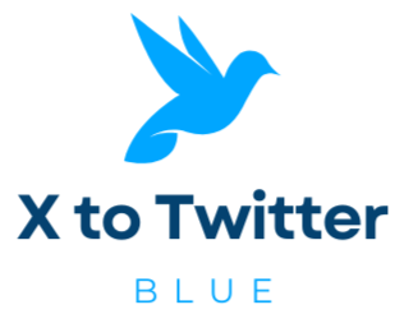

# X-To-Twitter-Blue

## Description
The Classic Blue Bird Chrome Extension is a simple and lightweight extension that replaces the new Twitter logo (the "x" logo) with the beloved old classic blue bird logo. This extension is designed for users who miss the nostalgic feeling of the classic Twitter logo and want to bring it back to their Twitter experience.

## Features
<ul>
  <li>Replaces the new Twitter logo with the classic blue bird logo for a nostalgic touch.</li>
</ul>

## Installation
<ol>
  <li>Download the extension from the Chrome Web Store: [Link to Chrome Web Store page]</li>
  <li>Click on the "Add to Chrome" button to install the extension.</li>
  <li>Enjoy the classic Twitter bird icon is waiting for you</li>
</ol>

## Screenshots

## Disclaimer
This extension is purely for entertainment purposes and not endorsed by Twitter or its parent company. Use it at your own risk. The extension does not collect any user data and adheres to the Chrome Web Store policies.

## Feedback and Support
If you encounter any issues or have suggestions for improving the Classic Blue Bird Chrome Extension, feel free to create an issue on the GitHub repository.
